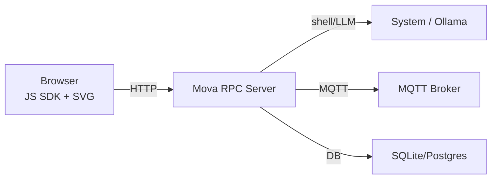

# Mova - Core Communication Layer

**Mova** is a lightweight, universal communication layer that connects frontend, backend, IoT devices, embedded systems, and LLM models. It provides a unified protocol for exchanging shell commands, form actions, logs, audio/video metadata, and arbitrary JavaScript code in browsers.

## Overview

Mova replaces Socket.IO and WebRTC Data Channels with a single, coherent RPC/HTTP/WebSocket/MQTT protocol. It supports environments from simple web applications to microcontrollers (Raspberry Pi, RP2040, Arduino).

### Key Features

- **Universal Protocol**: Single protocol replacing multiple communication layers
- **Cross-Platform**: Works on web browsers, servers, IoT devices, and embedded systems
- **SVG Containers**: SVG files serve as PWA application containers with embedded metadata and JS SDK scripts
- **Offline Support**: LocalStorage buffer with MQTT or database synchronization (SQLite/Postgres)
- **Modular Adapters**: HTTP, WebSocket, MQTT, SSH, gRPC support
- **CLI Integration**: `mova` CLI with shell execution, log publishing, and event filtering
- **Remote JS Execution**: `mova http` command for remote JavaScript execution in browser windows

## Architecture

### ASCII Diagram
```
 ┌─────────────┐      HTTP/WebSocket      ┌──────────────┐
 │  Frontend   │ ⇄──────────────────────>│   Mova RPC   │
 │ (JS SDK +   │                        │  Server      │
 │  SVG PWA)   │                        └──────┬───────┘
 └─────────────┘                               │
                                               │ Shell / LLM
                                           ┌───▼────────┐
                                           │  System &  │
                                           │  Ollama    │
                                           └────────────┘
```

### Mermaid Diagram


## Installation

### Prerequisites
- Python 3.11+
- Docker (optional, for full stack)

### Quick Install
```bash
pip install mova
```

### Development Install
```bash
git clone https://github.com/stream-ware/mova.git
cd mova/mova
make install
```

## Quick Start

### 1. Start Mova Server
```bash
make server
# Server runs on http://localhost:8092 (configurable in config/default.json)
```

### 2. Basic CLI Usage
```bash
# Execute shell commands
mova shell "docker ps"

# Send log messages
mova info "Hello, Mova!"
mova error --service my-app "Something went wrong"

# List recent logs
mova list error --last 5m
mova list all --watch
```

### 3. Browser Integration
Include the Mova SDK in your HTML:
```html
<script src="http://localhost:8092/sdk/mova-sdk.js"></script>
<script>
  Mova.init({
    serverUrl: 'http://localhost:8092',
    broker: { type: 'mqtt', url: 'ws://localhost:1883' }
  });

  Mova.on('command', cmd => console.log('Received:', cmd));
  Mova.send({ type: 'shell', payload: 'ls -la /' });
</script>
```

### 4. Remote JavaScript Execution
```bash
# Execute JavaScript in browser window
mova http localhost "console.log('Hello from Mova!'); alert('Remote execution works!');"
```

## Configuration

Default configuration is stored in `config/default.json`:

```json
{
  "server": {
    "host": "localhost",
    "port": 8092,
    "allow_shell": true
  },
  "mqtt": {
    "broker_url": "localhost:1883",
    "topic_prefix": "mova"
  },
  "database": {
    "type": "sqlite",
    "path": "data/mova.db"
  },
  "logging": {
    "level": "INFO",
    "format": "json"
  }
}
```

## Core Components

### CLI Commands
- `mova shell` - Execute shell commands
- `mova info/warning/error` - Send log messages
- `mova list` - List and filter logs
- `mova http` - Remote JavaScript execution
- `mova health` - Server health check
- `mova watch` - Real-time log monitoring

### Server Components
- **RPC Server**: HTTP/WebSocket endpoint handling
- **Command Router**: Route commands to appropriate handlers
- **Log Manager**: Centralized logging and filtering
- **Storage Layer**: SQLite/PostgreSQL abstraction
- **MQTT Adapter**: Message broker integration

### SDK Components
- **mova-sdk.js**: Browser JavaScript client
- **Connection Manager**: WebSocket/HTTP fallback
- **Message Router**: Command and response handling
- **DOM Integration**: SVG container manipulation

## Examples

See the `examples/` directory for complete usage examples:

- **Frontend**: SVG-based chat interface
- **Backend**: Diagnostic server with SQLite
- **IoT**: Raspberry Pi shell execution demo

## Development

### Running Tests
```bash
make test
```

### Code Formatting
```bash
make format
```

### Development Server
```bash
make server
```

## Contributing

1. Fork the repository
2. Create a feature branch
3. Add tests for new functionality
4. Run `make test` and `make format`
5. Submit a pull request

## License

Apache License 2.0

## Related Projects

- **movax**: Audio interface extensions (TTS/STT)
- **movacloud**: Cloud deployment and scaling
- **movaml**: Machine learning and NLP integration
- **movasec**: Security and authentication
- **movasmart**: IoT device management
- **movaweb**: Web dashboard and SDK templates
